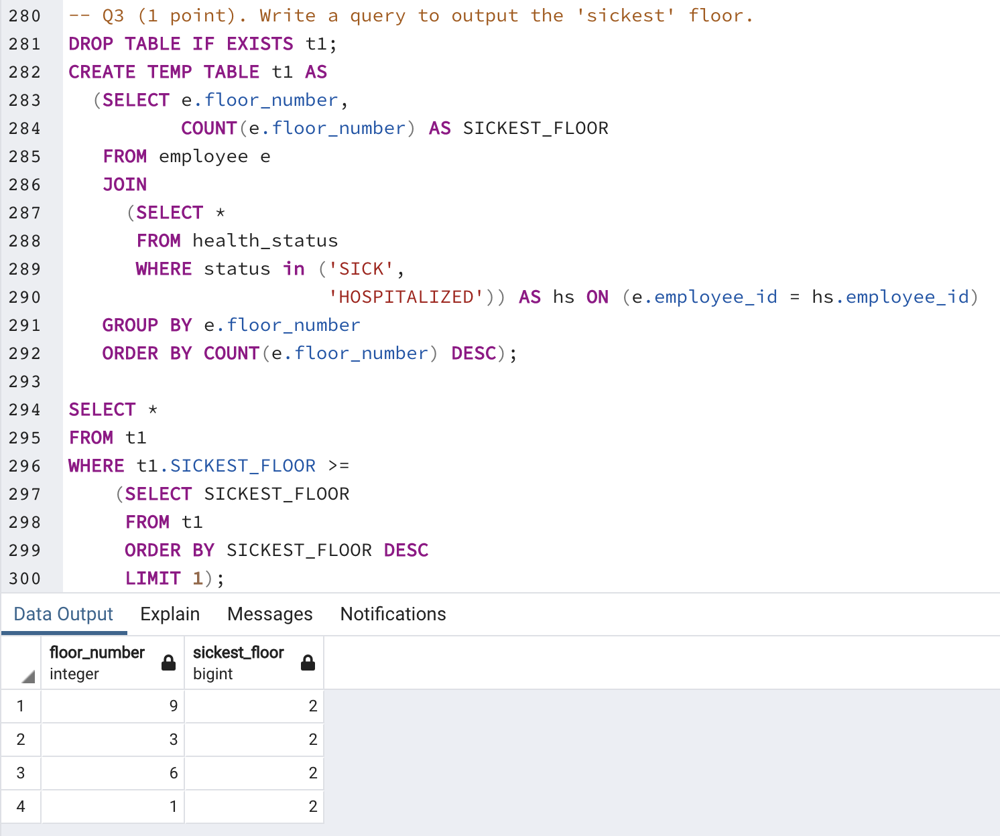
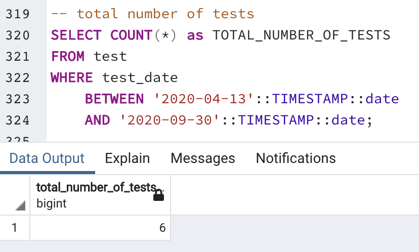

# CSCI585-DB (HW2)

### Submitted By: Ruchit Bhardwaj
### USC ID: 1111-4177-99

Database used: PostgreSQL (Locally Installed)
GUI used: PgAdmin v4

Q1: CREATE and INSERT queries for creating the table based on the barebones ER Diagram that was provided

Q2: Query to output most self-reported symptom (a report has been generated to take into consideration 2 or more entries with most self-reported symptom)

Q3: Query to output the sickest floor (a report has been generated to take into consideration 2 or more floors where there are equal number of sick patients)

Q4: Multiple queries to output total number of scans, total number of tests, total number of people who self-reported symptoms and total number of positive cases

Q5: Custom query: To identify which patient has had all the symptoms. I have used relational algebra division and this involves TABLE DIVISION.

ER Diagram URL = https://lucid.app/lucidchart/c1da8223-7cbb-422d-bf23-27b6c155d53d/edit?viewport_loc=-254%2C70%2C2521%2C1331%2C0_0&invitationId=inv_78b423eb-2eef-40d8-b55a-74cc7d8bd7aa

Refer https://github.com/ruch0401/code-practise/blob/main/leetcode/src/Problem019.java
for INSERT queries creation.